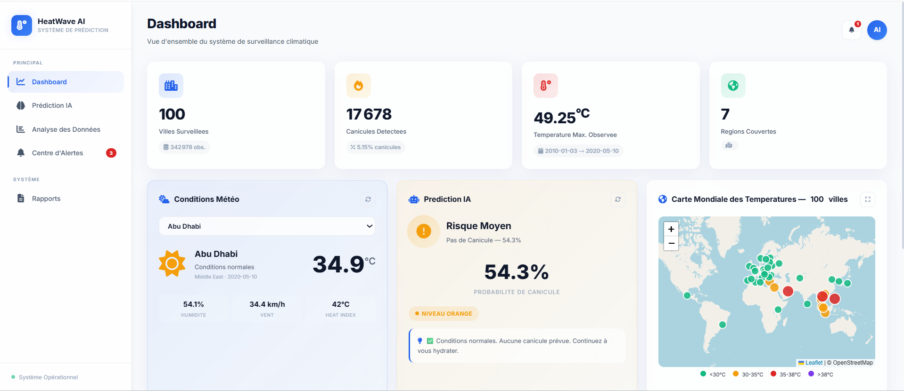
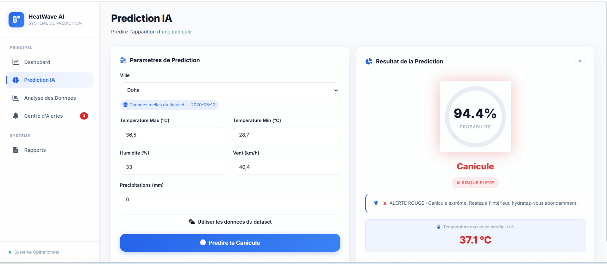
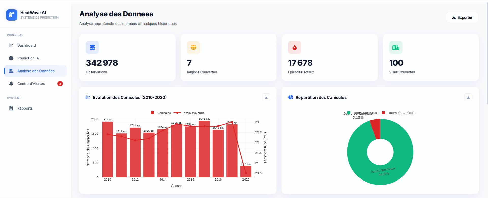
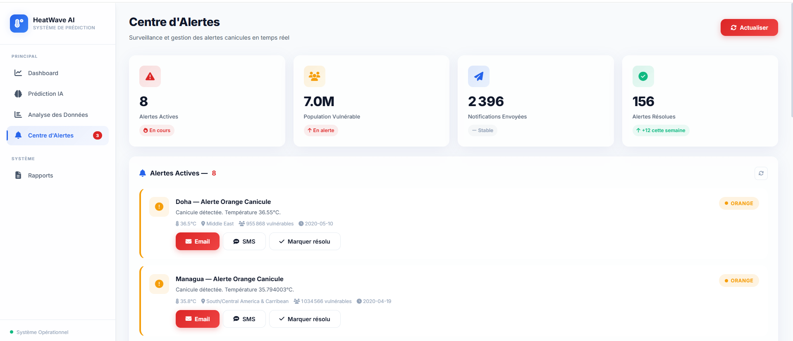
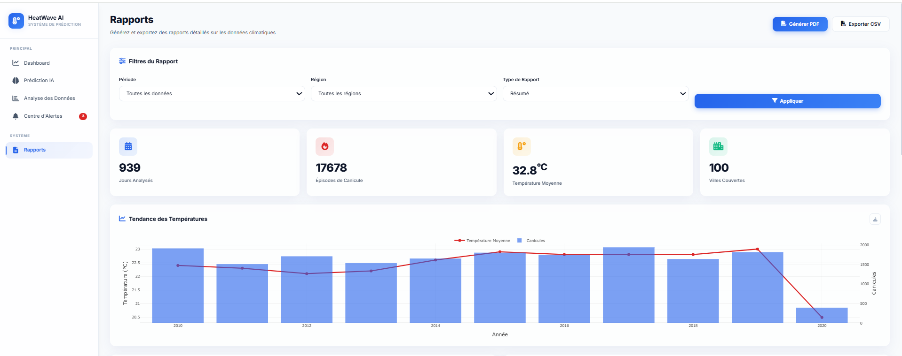

# 🌡️ HeatWave AI - Système Intelligent de Prédiction et d'Alerte Précoce des Canicules

## 📋 Description
Système de Machine Learning pour la prédiction et l'alerte précoce des canicules 
à partir de données climatiques historiques (2010-2020), développé dans le cadre 
du Master Intelligence Artificielle — Faculté des Sciences Ben M'Sick, 
Université Hassan II de Casablanca.

## 🎯 Objectifs
- Prédire l'apparition des canicules (Classification binaire is_heatwave)
- Prédire la température maximale à J+3 (Régression temp_max_J3)
- Alerter les populations vulnérables via un Centre d'Alertes
- Visualiser les données climatiques historiques (2010–2020)
- Expliquer les prédictions du modèle IA (Feature Importance Random Forest)

---
## 📊 Données du Projet
- **Observations** : 342 978
- **Villes** : 100
- **Régions** : 7
- **Période** : 2010–2020
- **Features** : 13 variables construites par feature engineering
- **Variable cible classification** : `is_heatwave` (seuil 35°C OMM)
- **Variable cible régression** : `temp_max_J3`
- **Taux de canicule** : 5.16% (ratio 1:18)

---

## 🤖 Modèles ML
| Tâche | Modèle | Métrique | Valeur |
|---|---|---|---|
| Classification | Random Forest | ROC-AUC | 0.9959 |
| Classification | Random Forest | F1-Score | 0.8476 |
| Classification | Random Forest | Precision | 0.9095 |
| Classification | Random Forest | Recall | 0.7937 |
| Régression | XGBoost | MAE | 2.332°C |
| Régression | XGBoost | RMSE | 3.199°C |
| Régression | XGBoost | R² | 0.8899 |

PROJET_ML/

├── app.py                          # Application Flask principale

├── requirements.txt                # Dépendances Python

├── README.md                       # Documentation

├── .gitignore

├── static/

│   ├── css/

│   │   └── style.css              # Styles Glassmorphism + Light Mode

│   └── images/

│       └── screens/               # Screenshots de l'interface

│           ├── dashboard.png

│           ├── prediction.png

│           ├── analytics.png

│           ├── alerts.png

│           └── reports.png

├── templates/

│   ├── base.html                  # Template de base (layout)

│   ├── dashboard.html             # Page 1 : Dashboard

│   ├── prediction.html            # Page 2 : Prédiction IA

│   ├── analytics.html             # Page 3 : Analyse des Données

│   ├── alerts.html                # Page 4 : Centre d'Alertes

│   └── reports.html               # Page 5 : Rapports

├── model/

│   ├── best_classifier.pkl        # Random Forest (classification)

│   ├── best_regressor.pkl         # XGBoost (régression J+3)

│   ├── scaler.pkl                 # StandardScaler

│   ├── le_region.pkl              # LabelEncoder régions

│   ├── le_city.pkl                # LabelEncoder villes

│   ├── model_metadata.json        # Métriques et features

│   └── feature_engineering_metadata.json

└── database/

├── heatwave_features.parquet  # Dataset enrichi (features)

├── heatwave_final.parquet     # Dataset avec is_heatwave

├── heatwave_merged.parquet    # Dataset fusionné nettoyé

└── city_temperature.csv       # Source brute Kaggle
---

## 🚀 Installation Locale

```bash
# 1. Cloner le projet
git clone <url_du_projet>
cd PROJET_ML

# 2. Créer l'environnement virtuel
python -m venv venv

# 3. Activer l'environnement
# Windows:
venv\Scripts\activate
# Linux/Mac:
source venv/bin/activate

# 4. Installer les dépendances
pip install -r requirements.txt

# 5. Lancer l'application
python app.py
```

---


####🌍  Accès à l'application en ligne

**URL** : [http://51.21.149.17:5000](http://51.21.149.17:5000)


## 📄 Pages
1. **Dashboard** : Vue d'ensemble avec KPI, conditions météo par ville,
   prédiction IA temps réel et carte mondiale des températures
2. **Prédiction IA** : Formulaire de prédiction avec jauge circulaire,
   probabilité de canicule, température J+3 et Feature Importance
3. **Analyse des Données** : EDA interactif — distributions, tendances
   climatiques, top villes, saisonnalité, relation Temp × Humidité
4. **Centre d'Alertes** : Alertes actives, notifications Email/SMS/Push,
   historique des alertes par ville et région
5. **Rapports** : Génération et export PDF/CSV des statistiques détaillées

---
## 🖥️ Interface de l'Application

### Dashboard Principal


### Prédiction IA


### Analyse des Données


### Centre d'Alertes


### Rapports



## 🔧 Technologies
- **Backend** : Python 3.12 / Flask
- **Frontend** : HTML5, CSS3, JavaScript
- **ML** : scikit-learn, XGBoost, LightGBM, imbalanced-learn (SMOTE)
- **Data** : pandas, numpy, pyarrow (parquet)
- **Interprétabilité** : SHAP, Feature Importance
- **Déploiement** : AWS EC2, Gunicorn, systemd

---

## 🎨 Design
- **Style** : Glassmorphism + Light Mode
- **Couleurs** : Bleu #2563EB, Orange #F59E0B, Rouge #DC2626
- **Animations** : Transitions fluides et modernes
- **Responsive** : Adapté aux écrans de toutes tailles

---

## 👥 Équipe
- **Outighli Sanae**
- **Ouarrak Layla**


**Encadrants** : Pr. BENLAHMAR ELHABIB | Pr. Oussama Kaich

**Année Universitaire** : 2025–2026

---


